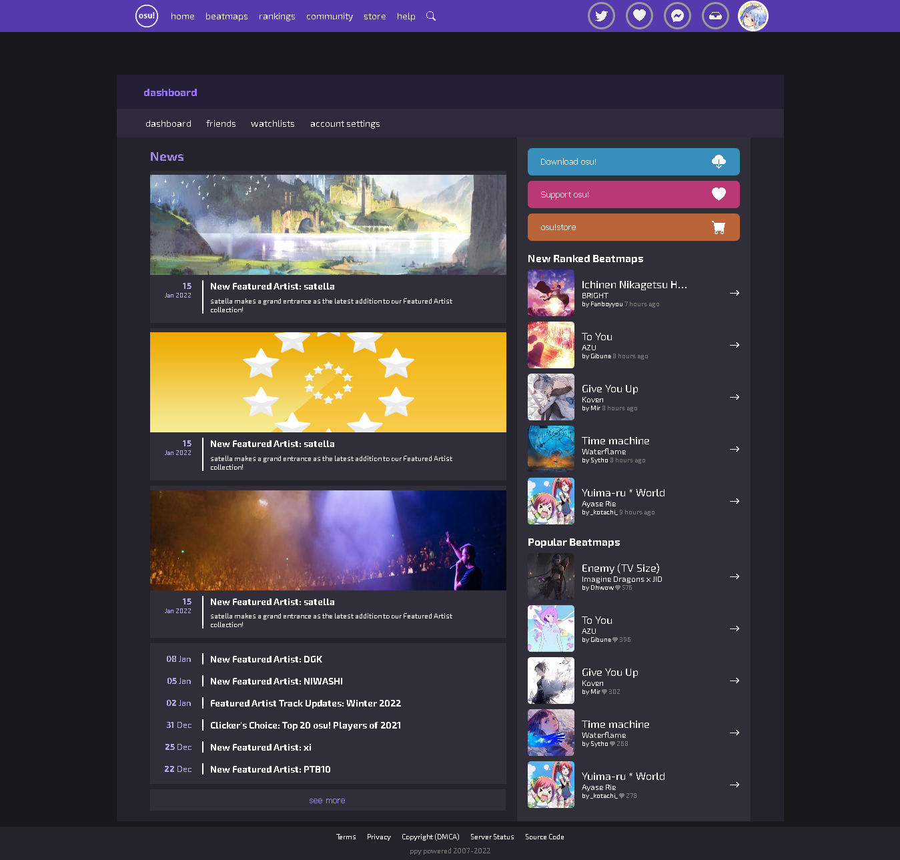
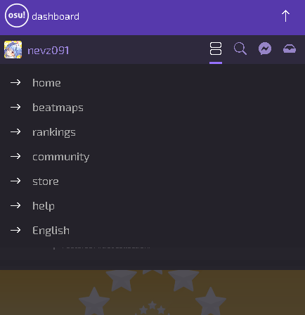

# Deployed on Firebase

[Website Preview](https://osu-nevz.web.app/)

#

Tried mobile-first approach and I don't know if it's easier/harder than doing desktop screen.. really clueless, but i'll try to do this approach more and see if i can find any difference. Also tried very basic JS, trying to dive deeper into JS.  
idk but this was fun... ilove osu!

# Desktop

# Mobile
  

All assets were taken from the Official Website [here](https://osu.ppy.sh/home)
