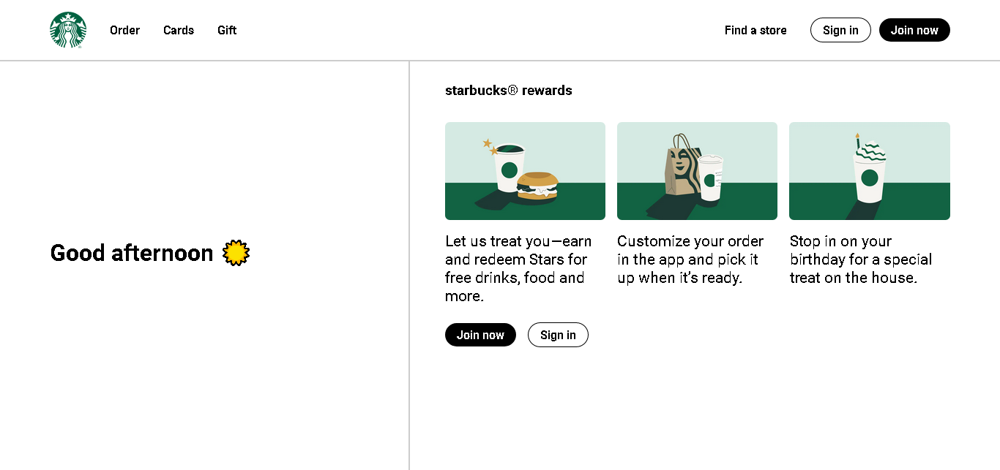
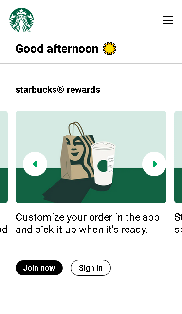

# Starbucks Website Clone

Starbucks website clone made with HTML, CSS and Javascript.

This is only intended for educational purposes. All assets were taken from the official website [here](https://app.starbucks.com/)

### Preview

### Links

- Starbucks: [https://app.starbucks.com/](https://app.starbucks.com/)

- Live Demo:

### Built with

- HTML5 and CSS3
- Javascript DOM Manipulation
- Sass
- Flexbox

##

Layouts, animations, and DOM manipulation are my weaknesses right now. For DOM manipulation, I kind of hard coded the carousel. CSS animation is definitely the hardest for me though, I really enjoyed making it, but at the same time dreaded the fact that it took so much time creating one simple animation.
