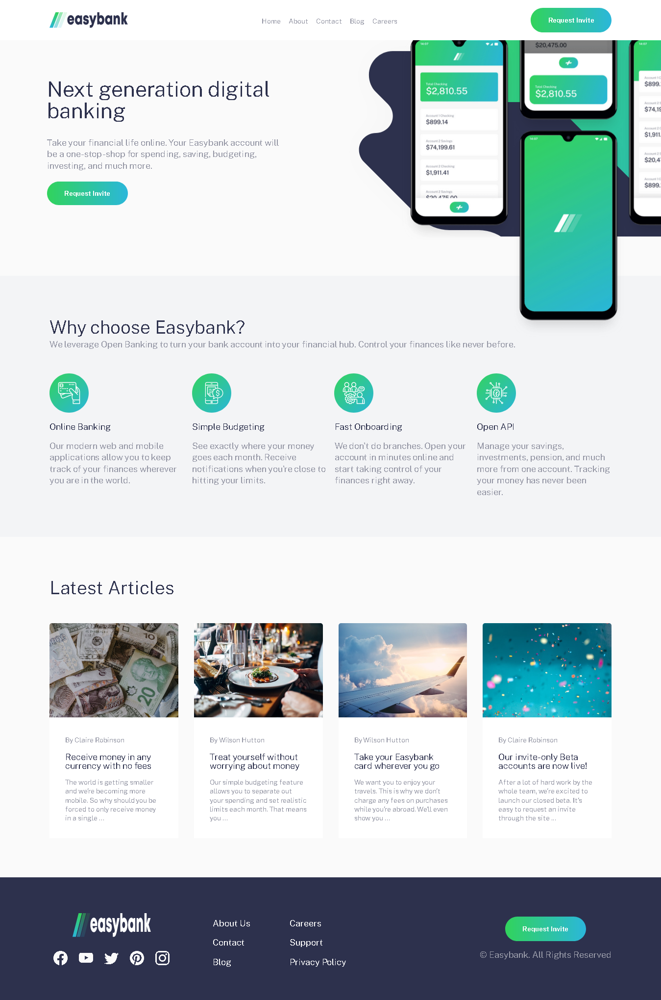
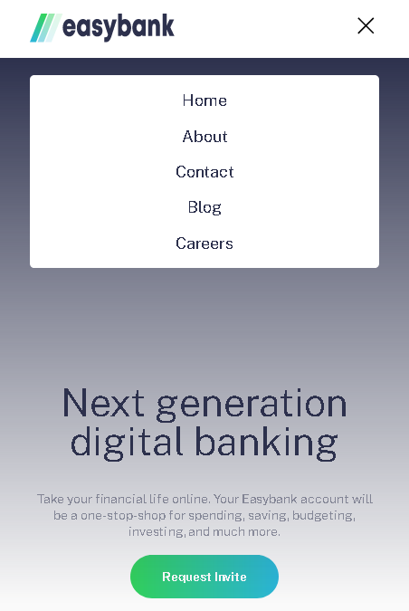
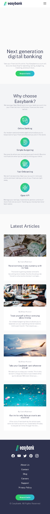

# Deployed on Firebase

[Website Preview](https://easybank-nevz.web.app/)

#

This was a challenge from frontend mentor. Learned a lot from this and tried Sass for the first time. It's really convenient, will definitely use it from now on.

# Desktop

# Mobile
  

All assets were taken from the Official Website [here](https://www.frontendmentor.io/challenges/easybank-landing-page-WaUhkoDN)

